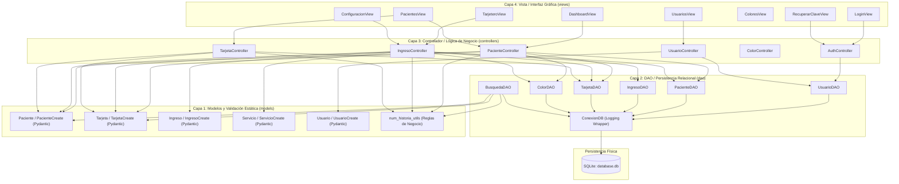

# UNIVERSIDAD NACIONAL EXPERIMENTAL POLITÉCNICA
# DE LA FUERZA ARMADA NACIONAL BOLIVARIANA
# UNEFA - NÚCLEO PORTUGUESA
# INGENIERÍA DE SISTEMAS

---

# MANUAL TÉCNICO DEL SISTEMA
## **SISTEMA DE GESTIÓN DE INFORMACIÓN ESTADÍSTICA Y REGISTROS DE SALUD (SGI SALUD)**
### **Hospital Dr. Armando Delgado Montero — Turén, Estado Portuguesa**

---

## 1. Introducción y Arquitectura del Sistema

### 1.1 Objetivo del Sistema
El Sistema de Gestión de Información Estadística y Registros de Salud (**SGI Salud**) ha sido diseñado y desarrollado con el propósito fundamental de automatizar y fortalecer el control operativo de los archivos clínicos del **Hospital Dr. Armando Delgado Montero**, ubicado en Turén, Estado Portuguesa. 

El núcleo del sistema resuelve la problemática histórica del archivo manual de historias médicas, implementando un mecanismo digitalizado de **búsqueda indexada, registro clínico y asignación cromática automatizada de tarjetas índice** (basado en el método decimal-terminal de archivo de historias médicas). Asimismo, incorpora un **Tarjetero de Ingresos y Egresos** en tiempo real para optimizar la gestión de ocupación de camas por servicios clínicos y agilizar los procesos de auditoría del departamento de estadísticas de salud.

### 1.2 Arquitectura de Software
La aplicación está cimentada bajo un patrón arquitectónico de **Estructuración Multicapa** inspirado en el paradigma **Modelo-Vista-Controlador (MVC)**, complementado con el patrón de **Objeto de Acceso a Datos (DAO)** para aislar y modularizar la lógica de persistencia. 

Esta separación estricta en cuatro niveles garantiza que el sistema posea alta mantenibilidad, cohesión y bajo acoplamiento:



#### Justificación Técnica de la Estructura en Capas:
1. **Modularidad e Independencia de la UI**: La interfaz gráfica desarrollada con CustomTkinter puede ser totalmente rediseñada o reemplazada (por ejemplo, por una aplicación web o API) sin alterar la lógica de negocio ni las sentencias SQL de persistencia.
2. **Robustez mediante Validación Temprana**: Los controladores no procesan ni envían datos inválidos a la base de datos, ya que la Capa de Modelos basada en **Pydantic** intercepta, valida y tipa de forma estricta los diccionarios antes de cualquier interacción transaccional.
3. **Optimización de Recursos del Servidor Local (SQLite)**: El uso de DAOs específicos con conexiones acotadas al tiempo de vida de la transacción evita el bloqueo de hilos y previene la corrupción del archivo `.db` ante apagones o fallos eléctricos en el hospital.

### 1.3 Stack Tecnológico y Librerías Detectadas

| Componente | Tecnología | Rol en la Aplicación |
|---|---|---|
| **Lenguaje Core** | Python v3.12+ | Entorno de programación estructurado y orientado a objetos de alto nivel. |
| **Framework GUI** | CustomTkinter v5.2.2 | Extensión moderna de la API nativa `tkinter`. Proporciona widgets avanzados con soporte para temas de color personalizados, apariencia clara/oscura en caliente y rendimiento nativo de escritorio. |
| **Motor de Persistencia** | SQLite3 | Base de datos relacional integrada en disco sin necesidad de servidor (embebida). Soporta transacciones ACID, tablas virtuales FTS5 e índices relacionales de alto desempeño. |
| **Validación de Esquemas** | Pydantic v2.13.4 | Biblioteca de validación de datos y análisis de tipos en tiempo de ejecución. Permite encapsular e inyectar validaciones mediante expresiones regulares de manera limpia y declarativa. |
| **Monitoreo de Sistema** | Loguru v0.7.3 | Framework de logs encargado del registro pormenorizado de transacciones, métricas de rendimiento y excepciones críticas del sistema en archivos diarios localizados en `/logs`. |
| **Criptografía** | Cryptography | Módulo de seguridad informática utilizado para el cifrado y hashing unidireccional de contraseñas de operador mediante el algoritmo estándar SHA-256. |
| **Concurrencia** | Threading (Standard) | Gestión asíncrona de procesos pesados en segundo plano (e.g., el hilo del daemon de copias de seguridad automáticas y la sincronización a la nube) para evitar el congelamiento de la GUI. |
| **Detección de OS** | Darkdetect v0.8.0 | Utilidad multiplataforma para detectar dinámicamente si el sistema operativo anfitrión tiene activo el modo claro u oscuro y adaptar la UI en consecuencia. |

---

## 2. Especificación de Requerimientos y Módulos Detectados

### 2.1 Requerimientos del Entorno (Estimación Técnica)

Para asegurar la correcta ejecución y estabilidad del software en el entorno del hospital, se estiman los siguientes requisitos:

| Recurso | Requisito Mínimo (Estaciones de Trabajo) | Requisito Recomendado |
|---|---|---|
| **Sistema Operativo** | Windows 10 (64-bits) o superior | Windows 10/11 (64-bits) |
| **Procesador** | Intel Core i3 / AMD Ryzen 3 (Dual-Core @ 2.0 GHz) | Intel Core i5 / AMD Ryzen 5 (Quad-Core @ 2.5 GHz o superior) |
| **Memoria RAM** | 2 GB | 4 GB |
| **Almacenamiento** | 200 MB libres en Disco Duro (HDD) para instalación. | 1 GB libre en Unidad de Estado Sólido (SSD) para el crecimiento de la BD y logs. |
| **Resolución de Pantalla**| 1024 x 768 píxeles | 1920 x 1080 píxeles |
| **Dependencia Software**| Python 3.12 instalado en el OS (si se ejecuta el script) | Ejecutable autónomo generado con PyInstaller. |

### 2.2 Ingeniería de Módulos (Frontend/GUI)

La interfaz gráfica de usuario está estructurada a nivel de componentes por pantallas aisladas que heredan de `customtkinter.CTkFrame` o `customtkinter.CTkToplevel`, cargándose dinámicamente en el contenedor central de `DashboardView`.

#### A. Módulo: `LoginView` (Acceso al Sistema)
- **Función Técnica**: Valida las credenciales del operador (usuario y contraseña) a través del controlador `AuthController`. Desencadena la creación del hilo de respaldo y la inicialización del panel administrativo una vez autenticado el operador.
- **Captura de Pantalla**: `[Insertar Captura de Pantalla de la Vista: LoginView]`
- **Componentes Interactivos y Disparadores**:

| Nombre del Widget | Tipo CustomTkinter | Acción / Evento Asociado |
|---|---|---|
| `entry_usuario` | `CTkEntry` | Entrada del nombre de usuario. Captura el evento `<Return>` para iniciar autenticación. |
| `entry_clave` | `CTkEntry` | Entrada de contraseña (máscara de caracteres activa `show='*'`). Captura evento `<Return>`. |
| `btn_login` | `CTkButton` | Dispara el método `self._iniciar_sesion()`, el cual valida campos y consulta al controlador. |
| `btn_recuperar` | `CTkButton` | Instancia de forma modal la ventana `RecuperarClaveView`. |
| `lbl_error` | `CTkLabel` | Etiqueta dinámica de texto rojo para mostrar mensajes de error devueltos por el controlador. |

#### B. Módulo: `RecuperarClaveView` (Recuperación de Credenciales)
- **Función Técnica**: Ventana modal transaccional de seguridad estructurada en tres pasos lógicos: 1) Localización del usuario, 2) Validación de respuestas a preguntas de seguridad de la base de datos, 3) Actualización de la clave del operador.
- **Captura de Pantalla**: `[Insertar Captura de Pantalla de la Vista: RecuperarClaveView]`
- **Componentes Interactivos y Disparadores**:

| Nombre del Widget | Tipo CustomTkinter | Acción / Evento Asociado |
|---|---|---|
| `entry_usuario` | `CTkEntry` | Entrada de texto para buscar el usuario. Dispara la validación preliminar en `_buscar_usuario`. |
| `btn_buscar` | `CTkButton` | Consulta la existencia del usuario y carga sus preguntas en el panel. |
| `entry_res1`, `entry_res2`, `entry_res3`| `CTkEntry` | Campos para el ingreso de las respuestas correspondientes a las preguntas de seguridad del usuario. |
| `btn_validar_preguntas`| `CTkButton` | Ejecuta la comparación criptográfica de respuestas contra los hashes almacenados. |
| `entry_nueva_clave` | `CTkEntry` | Entrada para la nueva clave. Valida longitud mínima. |
| `btn_guardar_nueva` | `CTkButton` | Dispara la actualización de clave en BD mediante `auth_controller.actualizar_clave_recuperada`. |

#### C. Módulo: `DashboardView` (Panel Principal y Navegación)
- **Función Técnica**: Actúa como contenedor de la interfaz de la aplicación. Posee un sidebar de navegación izquierdo responsivo y un panel dinámico a la derecha que aloja las diferentes vistas del sistema. Administra la sincronización del tema de colores general y el cierre seguro del programa.
- **Captura de Pantalla**: `[Insertar Captura de Pantalla de la Vista: DashboardView]`
- **Componentes Interactivos y Disparadores**:

| Nombre del Widget | Tipo CustomTkinter | Acción / Evento Asociado |
|---|---|---|
| `botones_menu` (Diccionario) | `CTkButton` | Conjunto de botones en el Sidebar ("Inicio", "Pacientes", "Tarjetero", "Colores", "Usuarios", "Configuración") que ejecutan la navegación interna y actualizan el título del header. |
| `btn_logout` | `CTkButton` | Invoca el callback de cierre de sesión destruyendo la ventana actual y reabriendo `LoginView`. |
| `sidebar` | `CTkFrame` | Contenedor izquierdo con scroll interno para dispositivos de pantallas reducidas. |

#### D. Módulo: `PacientesView` (Control de Pacientes e Historias Clínicas)
- **Función Técnica**: Pantalla unificada del sistema que combina un motor de búsqueda rápida, una tabla interactiva para visualización del censo de pacientes y un formulario lateral dinámico de registro y edición (CRUD) atómico de paciente y su tarjeta índice.
- **Captura de Pantalla**: `[Insertar Captura de Pantalla de la Vista: PacientesView]`
- **Componentes Interactivos y Disparadores**:

| Nombre del Widget | Tipo CustomTkinter | Acción / Evento Asociado |
|---|---|---|
| `combo_criterio` | `CTkOptionMenu` | Define el campo de búsqueda SQL: 'Todos', 'Cédula', 'Nombres/Apellidos', 'N. Historia', 'F. Nacimiento', 'Lugar Nacimiento'. |
| `entry_busqueda` | `CTkEntry` | Captura caracteres en tiempo real. Dispara la búsqueda al pulsar `<KeyRelease>` o presionar el botón asociado. |
| `btn_buscar` | `CTkButton` | Lanza la consulta en la base de datos SQLite y actualiza la tabla de resultados. |
| `btn_nuevo` | `CTkButton` | Comprime la tabla al 55% y despliega el formulario lateral para creación de registros. |
| `tabla_pacientes` | `CTkFrame` / Componente | Tabla customizada que responde a eventos de selección. Al hacer doble clic en una fila, expande el formulario lateral en modo edición cargando los datos del paciente seleccionado. |
| `combo_nacionalidad`| `CTkOptionMenu` | Dropdown del formulario ('V-', 'E-', 'S/C') para el tipo de cédula. Si es 'S/C' (Sin Cédula), deshabilita `entry_num_cedula`. |
| `entry_num_cedula` | `CTkEntry` | Entrada del número de cédula (admite solo caracteres numéricos). |
| `entry_num_historia`| `CTkEntry` | Entrada formateada del número de historia. Lanza el evento de teclado para actualizar la preview visual del color del archivado en vivo. |
| `canvas_color_preview`| `CTkFrame` | Recuadro que renderiza dinámicamente el color derivado del último par del número de historia ingresada. |
| `btn_guardar` | `CTkButton` | Dispara el proceso de validación Pydantic y registro en BD a través de `PacienteController`. |
| `btn_eliminar` | `CTkButton` | Muestra ventana de confirmación para ejecutar el borrado lógico del paciente (`estado = 0`). |

#### E. Módulo: `TarjeteroView` (Tarjetero de Ingresos y Ocupación Clínica)
- **Función Técnica**: Permite la visualización de la ocupación hospitalaria. En el panel izquierdo lista los servicios médicos disponibles, mostrando una barra de progreso indicativa del nivel de camas ocupadas. En la derecha, presenta en formato de galería de tarjetas o lista detallada a los pacientes hospitalizados con sus datos de ingreso.
- **Captura de Pantalla**: `[Insertar Captura de Pantalla de la Vista: TarjeteroView]`
- **Componentes Interactivos y Disparadores**:

| Nombre del Widget | Tipo CustomTkinter | Acción / Evento Asociado |
|---|---|---|
| `toggle_vista` | `CTkSegmentedButton` | Conmuta dinámicamente entre la vista de tarjetas ("🔲 Galería") y la vista de tabla tradicional ("≡ Lista"). |
| `scroll_servicios` | `CTkScrollableFrame`| Contenedor dinámico del listado de servicios. Genera un botón interactivo por cada servicio clínico que actualiza la sección de ocupación al seleccionarlo. |
| `btn_ingresar` | `CTkButton` | Despliega ventana popup modal para ingresar un paciente en el servicio seleccionado. |
| `btn_ajustes` | `CTkButton` | Despliega ventana popup modal para redefinir el número total de camas asignadas al servicio. |
| `btn_alta` (en cada tarjeta) | `CTkButton` | Dispara el egreso del paciente, liberando de forma inmediata la cama y actualizando los indicadores gráficos. |

#### F. Módulo: `ColoresView` (Guía de Referencia Cromática)
- **Función Técnica**: Módulo estático que presenta en cuadrícula la distribución matemática de los diez colores del sistema de archivo decimal-terminal, facilitando a los operadores la consulta del código del color asociado a los rangos de la decena del número de historia.
- **Captura de Pantalla**: `[Insertar Captura de Pantalla de la Vista: ColoresView]`
- **Componentes Interactivos y Disparadores**:
  - No posee componentes interactivos transaccionales (módulo estrictamente informativo con tarjetas cromáticas construidas con `CTkFrame` de color estático y `CTkLabel` descriptivos).

#### G. Módulo: `UsuariosView` (Administración de Operadores)
- **Función Técnica**: Administra el censo de operadores autorizados para utilizar el software. Cuenta con una tabla de usuarios del sistema y un formulario lateral para crear nuevos usuarios o actualizar existentes, incluyendo preguntas y respuestas de seguridad.
- **Captura de Pantalla**: `[Insertar Captura de Pantalla de la Vista: UsuariosView]`
- **Componentes Interactivos y Disparadores**:

| Nombre del Widget | Tipo CustomTkinter | Acción / Evento Asociado |
|---|---|---|
| `entry_usuario` | `CTkEntry` | Entrada para el username único. |
| `entry_clave` | `CTkEntry` | Entrada de contraseña. Si se está editando, puede dejarse vacía para conservar la anterior. |
| `combo_preg1`, `combo_preg2`, `combo_preg3`| `CTkOptionMenu` | Dropdowns con las preguntas prediseñadas del sistema para la recuperación de clave. |
| `entry_resp1`, `entry_resp2`, `entry_resp3`| `CTkEntry` | Entradas para las respuestas asociadas a las preguntas seleccionadas. |
| `btn_guardar` | `CTkButton` | Valida datos con `UsuarioCreate` e inserta/actualiza en la base de datos a través de `UsuarioController`. |
| `btn_desactivar` | `CTkButton` | Cambia el estado del usuario a `0` (desactivado/inactivo), impidiéndole acceder al sistema. |

#### H. Módulo: `ConfiguracionView` (Preferencias y Políticas de Respaldo)
- **Función Técnica**: Administra las preferencias globales persistidas en `config.json`. Ofrece controles para el cambio de apariencia, el tamaño de la tipografía de la interfaz, el modo de cálculo del número de historia (manual vs autogenerado por sistema), y la calendarización del cron-job de respaldos (local y en nube).
- **Captura de Pantalla**: `[Insertar Captura de Pantalla de la Vista: ConfiguracionView]`
- **Componentes Interactivos y Disparadores**:

| Nombre del Widget | Tipo CustomTkinter | Acción / Evento Asociado |
|---|---|---|
| `combo_tema` | `CTkOptionMenu` | Alterna temas: 'Oscuro', 'Claro', 'Personalizado'. Si es personalizado, despliega sub-paneles con selectores de color hexadecimales. |
| `combo_fuente` | `CTkOptionMenu` | Permite alternar la escala de tipografía: 'Pequeño', 'Normal', 'Grande', 'Muy Grande'. |
| `combo_historia` | `CTkOptionMenu` | Modo de número de historia: 'Manual' o 'Automático'. |
| `switch_backup_cierre` | `CTkSwitch` | Habilita/deshabilita la generación de un respaldo local `.db` de forma automática al cerrar la ventana principal del sistema. |
| `switch_backup_prog` | `CTkSwitch` | Activa el hilo programado periódico de copias de seguridad. |
| `entry_hora_backup` | `CTkEntry` | Define la hora de ejecución del respaldo programado en formato de 24 horas (HH:MM). |
| `switch_nube` | `CTkSwitch` | Habilita la exportación automatizada de archivos del backup local a Google Drive. |
| `entry_folder_drive` | `CTkEntry` | Entrada para el Identificador de Carpeta destino en Google Drive. |
| `btn_probar_drive` | `CTkButton` | Invoca de forma asíncrona un hilo para testear la conectividad y validez de las credenciales de la API de Google. |
| `btn_guardar` | `CTkButton` | Persiste las configuraciones en `config.json` e invoca al callback en caliente de `DashboardView` para redibujar la interfaz. |

---

## 3. Modelado de Datos y Reglas de Negocio Implícitas

### 3.1 Diccionario de Datos (Base de Datos Relacional SQLite)

La base de datos se almacena en el archivo binario local `/database/database.db` y se autogestiona en la inicialización a partir del esquema `/database/schema.sql`.

#### Tabla A: `colores`
Almacena el catálogo de colores disponibles en la escala cromática decimal-terminal.

| Campo | Tipo de Datos | Restricciones | Descripción Funcional |
|---|---|---|---|
| `id` | INTEGER | PRIMARY KEY AUTOINCREMENT | Identificador numérico secuencial interno del color. |
| `valor` | TEXT | NOT NULL | Nombre comercial del color (Ej: "Marrón", "Azul Marino"). |
| `estado` | INTEGER | NOT NULL | Borrado lógico: `1` = Activo, `0` = Eliminado. |

#### Tabla B: `pacientes`
Almacena la información de identidad e historia médica de los pacientes del centro asistencial.

| Campo | Tipo de Datos | Restricciones | Descripción Funcional |
|---|---|---|---|
| `id` | INTEGER | PRIMARY KEY AUTOINCREMENT | Identificador interno del paciente. |
| `nombre1` | TEXT | NOT NULL | Primer nombre obligatorio. |
| `nombre2` | TEXT | Nullable | Segundo nombre opcional. |
| `apellido1` | TEXT | NOT NULL | Primer apellido obligatorio. |
| `apellido2` | TEXT | Nullable | Segundo apellido opcional. |
| `cedula` | TEXT | Nullable | Cédula. Admite `NULL` para pacientes sin cédula (S/C). |
| `lugar_nacimiento`| TEXT | NOT NULL | Localidad geográfica de origen del paciente. |
| `fecha_nacimiento`| TEXT | NOT NULL | Fecha de nacimiento almacenada en formato estructurado (DD/MM/AAAA). |
| `estado_vital` | INTEGER | NOT NULL | Estado de vida: `1` = Vivo, `0` = Fallecido. |
| `estado` | INTEGER | NOT NULL | Borrado lógico: `1` = Activo, `0` = Inactivo/Eliminado. |

#### Tabla C: `tarjetas`
Registra la relación entre el paciente, su número de historia clínica y el color de archivo asignado.

| Campo | Tipo de Datos | Restricciones | Descripción Funcional |
|---|---|---|---|
| `id` | INTEGER | PRIMARY KEY AUTOINCREMENT | Identificador secuencial de la tarjeta índice. |
| `num_historia` | TEXT | NOT NULL, UNIQUE | Código único de historia clínica en formato `XX-XX-XX`. |
| `id_paciente` | INTEGER | NOT NULL, FOREIGN KEY | Relación 1:1. Referencia a `pacientes(id)`. |
| `id_color` | INTEGER | NOT NULL, FOREIGN KEY | Relación N:1. Referencia a `colores(id)`. |
| `estado` | INTEGER | NOT NULL | Borrado lógico: `1` = Activa, `0` = Eliminada. |

#### Tabla D: `usuarios`
Registra los datos de acceso y las preguntas de desafío para la recuperación de contraseñas de los operadores del sistema.

| Campo | Tipo de Datos | Restricciones | Descripción Funcional |
|---|---|---|---|
| `id` | INTEGER | PRIMARY KEY AUTOINCREMENT | Identificador secuencial único del operador. |
| `nombre` | TEXT | NOT NULL | Nombre de pila del operador de admisiones. |
| `apellido` | TEXT | NOT NULL | Apellido del operador. |
| `cedula` | INTEGER | NOT NULL, UNIQUE | Documento de identidad numérico nacional del operador. |
| `usuario` | TEXT | NOT NULL, UNIQUE | Username para la autenticación en el login. |
| `clave` | TEXT | NOT NULL | Contraseña encriptada/hasheada mediante SHA-256. |
| `estado` | INTEGER | Nullable | Borrado lógico: `1` = Activo, `0` = Desactivado. |
| `pregunta1` | TEXT | Nullable | Enunciado de la primera pregunta de desafío. |
| `respuesta1` | TEXT | Nullable | Hash SHA-256 de la respuesta a la primera pregunta. |
| `pregunta2` | TEXT | Nullable | Enunciado de la segunda pregunta de desafío. |
| `respuesta2` | TEXT | Nullable | Hash SHA-256 de la respuesta a la segunda pregunta. |
| `pregunta3` | TEXT | Nullable | Enunciado de la tercera pregunta de desafío. |
| `respuesta3` | TEXT | Nullable | Hash SHA-256 de la respuesta a la tercera pregunta. |

#### Tabla E: `servicios`
Establece los diferentes departamentos o especialidades clínicas del hospital y su aforo.

| Campo | Tipo de Datos | Restricciones | Descripción Funcional |
|---|---|---|---|
| `id` | INTEGER | PRIMARY KEY AUTOINCREMENT | Identificador único del servicio clínico. |
| `nombre` | TEXT | NOT NULL, UNIQUE | Nombre del servicio (Ej: "Pediatría", "Medicina Interna"). |
| `total_camas` | INTEGER | NOT NULL | Capacidad total instalada de camas en la sala física. |
| `estado` | INTEGER | NOT NULL, DEFAULT 1 | Borrado lógico: `1` = Activo, `0` = Desactivado. |

#### Tabla F: `ingresos`
Controla el registro de pacientes ingresados en los servicios clínicos del hospital.

| Campo | Tipo de Datos | Restricciones | Descripción Funcional |
|---|---|---|---|
| `id` | INTEGER | PRIMARY KEY AUTOINCREMENT | Identificador único del registro de ingreso. |
| `id_paciente` | INTEGER | NOT NULL, UNIQUE, FOREIGN KEY | Referencia a `pacientes(id)`. La unicidad evita multi-ingresos. |
| `id_servicio` | INTEGER | NOT NULL, FOREIGN KEY | Referencia a `servicios(id)`. |
| `fecha_ingreso` | TEXT | NOT NULL | Fecha y hora en la que ingresa el paciente al servicio. |
| `estado` | INTEGER | NOT NULL, DEFAULT 1 | Estado del ingreso: `1` = Activo, `0` = Egresado/Cerrado. |

---

### 3.2 Reglas de Negocio Automatizadas

El código fuente implementa y automatiza diversas políticas operativas sanitarias del hospital, validándolas tanto en backend (Capa Controladores/Modelos) como a nivel de base de datos relacional:

#### A. Restricción de Unicidad y Relación Unívoca de Tarjetas (1:1)
- **Lógica Implícita**: Un paciente activo del Hospital Dr. Armando Delgado Montero no puede poseer más de una historia médica asignada en el archivo.
- **Implementación**: El controlador `PacienteController` y el DAO de tarjetas bloquean cualquier intento de crear un registro en `tarjetas` para un `id_paciente` que ya cuenta con una tarjeta activa. La base de datos impone una restricción de clave única (`UNIQUE`) sobre la columna `num_historia` en la tabla `tarjetas`. En la tabla `ingresos`, el campo `id_paciente` es `UNIQUE`, impidiendo que un paciente figure hospitalizado en dos servicios simultáneamente.

#### B. Algoritmo de Categorización y Asignación de Color en Archivo
- **Lógica Implícita**: El color de la pestaña física de la historia médica en el archivo central del hospital se determina exclusivamente a partir del último par de dígitos (la decena) del número de historia clínica asignado al paciente.
- **Implementación**: El usuario nunca selecciona el color. El backend lee el número de historia formateado `XX-XX-XX` mediante las rutinas en `num_historia_utils.py`, extrae el último par de dígitos, lee la decena correspondiente y busca el ID cromático asociado en la tabla de base de datos.
- **Ejemplo Algorítmico**:
  - Número de historia: `12-45-78`
  - Último par: `78`
  - Primer dígito del par (Decena): `7`
  - Rango: `70-79` $\rightarrow$ Color asignado: **Amarillo** (Hex: `#FFD700`, ID base de datos: `8`).

#### C. Exclusión de Identificación para Pacientes Infantiles (Sin Cédula)
- **Lógica Implícita**: Los pacientes recién nacidos o menores de edad que aún no cuentan con documento de identidad nacional deben registrarse en el sistema utilizando la codificación de archivo estándar, pero sin violar la unicidad de las cédulas del censo general.
- **Implementación**: En la interfaz, al marcar la opción `S/C` (Sin Cédula), se desactiva el campo y el controlador envía el valor `None` (NULL de base de datos) a la columna `cedula`. Al estar en formato NULL, la base de datos permite múltiples registros sin cédula, mientras que si se ingresa un valor de cédula real, el backend valida preventivamente su unicidad consultando al `PacienteDAO`.

#### D. Validación de Formatos de Inputs mediante Expresiones Regulares
Los campos del sistema se someten a validación estricta utilizando el motor de expresiones regulares de Python en la capa de modelos de Pydantic:
- **Cédula**: Debe coincidir con la expresión regular `^[VvEe]-\d{6,10}$` o ser `"S/C"`. Es normalizada automáticamente a mayúsculas (`V-12345678`).
- **Número de Historia**: Debe coincidir exactamente con la expresión regular `^\d{2}-\d{2}-\d{2}$`. No se permiten letras ni formatos continuos (Ej: `037734` es rechazado).
- **Fecha de Nacimiento**: Expresión regular `^\d{2}[/\-]\d{2}[/\-]\d{4}$`. El backend valida adicionalmente la coherencia calendárica (Ej: impide registrar fechas futuras, o meses mayores a 12). Convierte separadores de guion en barras `/` automáticamente.
- **Nombres y Apellidos**: Campos obligatorios no vacíos. Se eliminan los espacios en blanco sobrantes en los extremos.

#### E. Control de Privilegios e Inactivación Lógica (Soft Delete)
- **Lógica Implícita**: Por razones de auditoría médica, estadísticas de morbilidad y requerimientos legales del Ministerio del Poder Popular para la Salud, los datos de pacientes y usuarios nunca deben borrarse físicamente de la base de datos.
- **Implementación**: Toda operación de borrado cambia el atributo `estado` a `0`. Las consultas de búsqueda de la interfaz filtran los resultados agregando de manera explícita la cláusula `WHERE estado = 1`. Los usuarios desactivados (`estado = 0`) son bloqueados en el login de forma inmediata por `AuthController`.

---

## 4. Guía de Desarrollo y Mantenimiento del Código

### 4.1 Árbol de Directorios Real del Proyecto

El mapa de directorios real del software se desglosa en el manual técnico adjunto, reflejando fielmente la estructura en capas MVC + DAO y las herramientas transversales implementadas en `/src/utils`.

### 4.2 Configuración del Entorno de Desarrollo

Para inicializar y ejecutar este proyecto comunitario en una nueva estación de trabajo en el hospital, ejecute la siguiente secuencia de comandos en la terminal de PowerShell o CMD en la raíz del proyecto:

```powershell
# 1. Crear el entorno virtual aislado para Python (Garantiza independencia de librerías del OS)
python -m venv .venv

# 2. Activar el entorno virtual en sistemas operativos Windows
.venv\Scripts\activate

# 3. Actualizar la herramienta de gestión de paquetes (pip) a su última versión
python -m pip install --upgrade pip

# 4. Instalar de manera automatizada las dependencias declaradas en el proyecto
pip install -r requirements.txt

# 5. Ejecutar la siembra de la base de datos (Crea la base de datos relacional, 
# genera las tablas e inserta los colores iniciales y el usuario administrador de prueba)
python seed.py

# 6. Iniciar la ejecución de la aplicación gráfica de escritorio
python main.py
```

### 4.3 Guía de Escalabilidad (Instrucciones para Futuros Desarrolladores)

Si se requiere extender o modificar el sistema en el futuro, siga las directrices técnicas que se detallan a continuación para garantizar la homogeneidad de la arquitectura:

#### Caso A: Añadir un nuevo campo en la base de datos (Ej: "teléfono" en la tabla pacientes)
1. **Modificación del Esquema SQL**: Abra `database/schema.sql` y agregue el campo `telefono TEXT` en la sentencia `CREATE TABLE IF NOT EXISTS "pacientes"`.
2. **Actualización de la Vista SQL**: Modifique la vista `vista_paciente_tarjeta` agregando `pacientes.telefono` en el bloque de selección para que pueda ser leído en búsquedas.
3. **Modificación del Modelo Pydantic**: Abra `src/models/paciente.py`. En la clase `PacienteBase`, defina el campo: `telefono: str | None = None`. Adicione reglas en caso de requerir un formato numérico telefónico específico.
4. **Actualización de Mapeo en el DAO**: Abra `src/dao/paciente.py`. Modifique la consulta de inserción en `crear()` y de actualización en `actualizar()` para incluir el parámetro correspondiente al teléfono. En el conversor de filas a objetos `_fila_a_paciente()`, verifique que el nuevo campo se asigne correctamente.
5. **Incorporación en la Vista (GUI)**: Abra `src/views/pacientes_view.py`. Agregue un widget `CTkLabel` y un `CTkEntry` (`self.entry_telefono`) en el contenedor del formulario lateral. Incorpore el valor del campo en el diccionario que se envía al controlador al presionar el botón guardar, y límpielo en la rutina de refresco.

#### Caso B: Alterar o agregar un color de tema a la interfaz visual
1. **Edición del Modelo de Colores**: Abra `src/models/config.py`. Si desea agregar una nueva propiedad de color (Ej: `COLOR_HEADER`), defínala en la clase `ColoresPersonalizados` estableciendo un valor por defecto.
2. **Definición de Temas**: Abra `src/models/tema.py`. Incorpore la variable en los diccionarios estáticos de `TEMA_OSCURO` y `TEMA_CLARO`.
3. **Mapeo en Vistas**: En los archivos de vista (por ejemplo, `dashboard_view.py`), lea el nuevo color en el método `_cargar_colores_desde_config()` mediante `self.colores.get("nueva_propiedad")` y aplíquelo en el parámetro `fg_color` o `text_color` del widget respectivo.
4. **Personalización Dinámica**: Modifique `src/views/configuracion_view.py` agregando un selector interactivo (`SelectorColorPopup`) para que el operador pueda cambiar dicho color dinámicamente desde la pantalla de configuración del sistema.

---

## 5. Lógica de los Procesos Críticos

### 5.1 Gestión de Persistencia y Errores (CRUD)

El acceso a la base de datos se rige por un **patrón Wrapper de Monitoreo** diseñado en `src/dao/conexion.py`. La clase `ConexionDB` no expone de manera directa el objeto nativo `sqlite3.Connection`, sino que lo envuelve en `LoggingConnection` y `LoggingCursor`.

```
[Clase DAO] ──(Petición)──> [LoggingConnection] ──(Cursor Wrapper)──> [LoggingCursor]
                                                                            │
      ┌─────────────────────────────────────────────────────────────────────┤
      ▼ (Exito: Tiempo < 100ms)    ▼ (Exito: Tiempo >= 100ms)    ▼ (Fallo de SQL / Excepción)
  [Loguru: logger.success]     [Loguru: logger.warning]     [Loguru: logger.error]
  "SQL Execute: [query]"       "Slow Query bottleneck!"     "SQL Error: [Detalle]"
                                                                            │
                                                                            ▼
                                                                     [Raise Exception]
```

#### Ventajas del Logging Wrapper para el Entorno Hospitalario:
1. **Auditoría de Rendimiento**: Cualquier consulta SQL que sufra de latencia superior al umbral de `100 ms` se etiqueta automáticamente en los logs como `[CUELLO DE BOTELLA]`. Esto facilita a los desarrolladores identificar la necesidad de crear nuevos índices.
2. **Registro de Fallos Críticos**: Al capturarse cualquier excepción dentro de `LoggingCursor.execute()`, se escribe inmediatamente en el archivo de log diario con el texto de la consulta SQL fallida y los parámetros asociados antes de elevar la excepción con `raise`.

#### Lógica del CRUD en los DAOs:
- **Operaciones de Lectura**: Almacenadas dentro de bloques `try-finally` para asegurar el cierre oportuno de la conexión (`conn.close()`) liberando la memoria.
- **Operaciones de Escritura / Actualización**: Se envuelven en bloques `try-except sqlite3.IntegrityError`. Esto permite interceptar colisiones en restricciones `UNIQUE` (Ej: si se intenta registrar una historia clínica repetida). En lugar de romper la ejecución del programa de escritorio, el DAO captura el error relacional y devuelve `-1` o `False` de forma controlada al controlador. El controlador traduce esta bandera en un mensaje amigable para el operador de admisiones del hospital (Ej: *"El número de historia ya existe"*).

---

### 5.2 Lógica de Búsqueda y Filtrado

Para asegurar un rendimiento óptimo de búsqueda sobre un volumen de decenas de miles de pacientes, el sistema implementa una **arquitectura de búsqueda híbrida** que combina:
1. **Índices Tradicionales**: Índices sobre columnas clave como `pacientes(cedula)`, `pacientes(apellido1)`, `pacientes(nombre1)` para consultas de coincidencia exacta y ordenamiento rápido.
2. **Tabla Virtual FTS5 (Búsqueda de Texto Completo)**: La tabla `pacientes_fts` utilizando el tokenizador de trigramas (`trigram`) de SQLite.

#### Sincronización Automática mediante Disparadores (Triggers)
Para evitar la duplicidad lógica en la inserción manual, la base de datos gestiona de manera interna la consistencia de la tabla virtual mediante disparadores automáticos definidos en `schema.sql`:

```sql
-- Sincronización tras inserción
CREATE TRIGGER IF NOT EXISTS pacientes_ai AFTER INSERT ON pacientes
BEGIN
  INSERT INTO pacientes_fts(id_paciente, nombres, apellidos, cedula) 
  VALUES (new.id, new.nombre1 || ' ' || COALESCE(new.nombre2, ''), new.apellido1 || ' ' || COALESCE(new.apellido2, ''), new.cedula);
END;

-- Sincronización tras actualización
CREATE TRIGGER IF NOT EXISTS pacientes_au AFTER UPDATE ON pacientes
BEGIN
  INSERT INTO pacientes_fts(pacientes_fts, rowid, id_paciente, nombres, apellidos, cedula)
  VALUES ('delete', old.id, old.id, old.nombre1 || ' ' || COALESCE(old.nombre2, ''), old.apellido1 || ' ' || COALESCE(old.apellido2, ''), old.cedula);
  INSERT INTO pacientes_fts(rowid, id_paciente, nombres, apellidos, cedula)
  VALUES (new.id, new.id, new.nombre1 || ' ' || COALESCE(new.nombre2, ''), new.apellido1 || ' ' || COALESCE(new.apellido2, ''), new.cedula);
END;
```

#### Flujo Algorítmico de Búsqueda Reactiva en la Interfaz:
El motor de búsqueda opera en tiempo real bajo la siguiente secuencia algorítmica:

```
[Usuario teclea en entry_busqueda]
              │
              ▼
[Evento: <KeyRelease>] ──(Espera temporizada / Desrebote)──> [Invoca buscar_pacientes()]
                                                                      │
  ┌───────────────────────────────────────────────────────────────────┘
  ▼
[BusquedaController.buscar(criterio, termino)]
  │
  ├─► Si Criterio = 'Todos': Retorna lista completa ordenada.
  │
  ├─► Si Criterio = 'Nombres/Apellidos':
  │     Llama a BusquedaDAO.buscar_fts(termino)
  │       │
  │       └─► SQLite: SELECT id_paciente FROM pacientes_fts WHERE nombres MATCH 'term*' OR apellidos MATCH 'term*'
  │
  └─► Si Criterio = 'Cédula', 'N. Historia', 'Lugar', etc:
        Llama a BusquedaDAO.buscar_por_criterio(criterio, termino)
          │
          └─► SQLite: SELECT * FROM vista_paciente_tarjeta WHERE [campo] LIKE '%termino%' AND estado = 1
                                                                      │
                                                                      ▼
                                                       [Convierte filas a TarjetaSalida]
                                                                      │
                                                                      ▼
                                                       [Refresca reactivamente la Tabla GUI]
```

Este algoritmo garantiza búsquedas instantáneas en tiempo real en la interfaz gráfica (menos de 5 milisegundos de tiempo de respuesta bajo miles de registros), eliminando la necesidad de implementar motores externos y permitiendo un despliegue de escritorio ágil y de alta fidelidad técnica.
